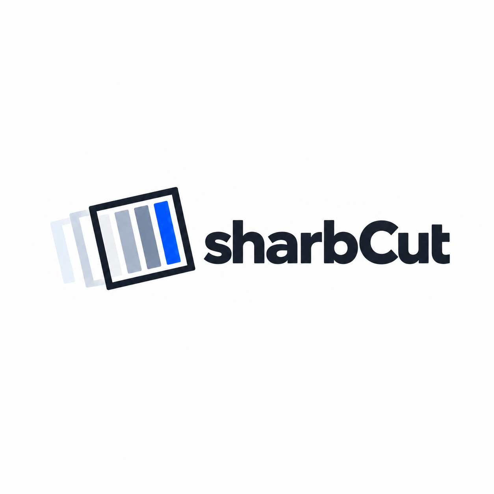
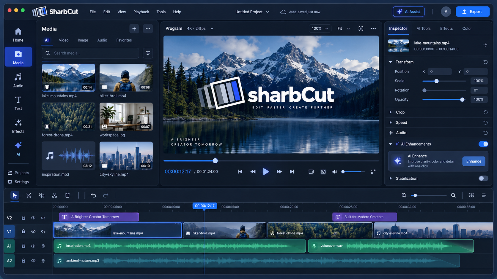

# SharbCut

<div align="center">
  
  <p><strong>面向 Windows 的现代桌面视频剪辑器，提供可编辑时间线、AI 辅助剪辑和音乐节拍混剪。</strong></p>
</div>

SharbCut 基于 [Concat](https://github.com/jub0t/Concat) 开发。手动剪辑、AI 剪辑和节拍混剪使用同一条项目时间线；生成的剪辑仍可继续编辑，并支持撤销和重做。

## 功能

- **可编辑时间线：** 多轨片段、预览、转场、特效、音频、标题、字幕和导出。
- **AI Agent：** 用自然语言描述剪辑要求。SharbCut 会先校验 AI 提出的时间线操作，再将其作为可撤销的编辑应用。
- **BGM 节拍混剪：** 使用项目中的媒体生成卡点剪辑，并将保留源素材关联的片段直接放入时间线。
- **默认 BMTS-lite：** 日常卡点任务默认使用快速模式；完整 BGM-Montage 分析作为高级选项保留。
- **文字与字幕：** 添加和编辑文字片段，无需将其烘焙进最终视频。
- **撤销与重做：** 完成 AI 或混剪操作后，仍可继续手动编辑。
- **Windows 安装包：** 安装版和便携 ZIP 均包含应用运行时与媒体工具，普通用户无需另行安装 Rust、Cargo、CMake 或 FFmpeg。

## 预览

下图是保存在 `design-reference` 中的 UI 概念图，并非当前应用构建版本的实际截图。



## 下载与安装

首个公开版本为 [v0.3.0](https://github.com/sharbvane/sharbcut/releases/tag/v0.3.0)。

- [Windows x64 安装版 — SharbCutSetup.exe](https://github.com/sharbvane/sharbcut/releases/download/v0.3.0/SharbCutSetup.exe)：运行安装程序，然后从开始菜单启动 SharbCut。
- [便携版 — SharbCut-Windows-x64.zip](https://github.com/sharbvane/sharbcut/releases/download/v0.3.0/SharbCut-Windows-x64.zip)：解压后运行 `SharbCut.exe`。`portable` 目录会在应用旁保存本地设置和下载的模型。

两个发行包均面向 Windows x64。SHA-256 校验值见 Release 说明。项目会引用原位置的源媒体文件；移动或删除这些文件可能导致时间线中的素材无法使用。

## 配置 AI 剪辑

在 SharbCut 中打开 **AI 剪辑**，填写兼容 OpenAI Chat Completions 的接口地址、API Key 和模型。例如：

```text
Base URL: https://api.example.com/v1
模型: 由你选择的模型名称
API Key: 在应用中填写你自己的密钥
```

远程服务请使用 HTTPS。本地 HTTP 仅允许用于 `localhost` 和 `127.0.0.1`。API Key 保存在 Windows 凭据管理器中，不会写入项目文件。推理强度为可选项，具体取决于服务提供方。

执行 AI 剪辑时，SharbCut 可能会向你配置的接口发送项目和时间线元数据、媒体名称与路径、最多四张低分辨率预览帧，以及（若所选素材已有相关信息）音频摘要或简短转录文本。发送私人素材或项目数据前，请先查看服务提供方的隐私条款。普通本地剪辑和 BGM 混剪无需连接 AI 服务。

## 开发

开发目标为 Windows x64，使用 MSVC 工具链和 Windows SDK。项目级工具和缓存由初始化脚本放在 Git 忽略的 `.tools` / `vendor` 目录中；Visual Studio Build Tools 与 Windows SDK 按常规方式安装。

```powershell
.\scripts\setup-dev.ps1
Push-Location .\engine
cargo check -p concat --locked
cargo build -p concat --locked
Pop-Location
.\scripts\run-dev.ps1 -SkipBuild
```

使用以下命令创建 Windows 安装包和便携 ZIP：

```powershell
.\scripts\package-windows.ps1
```

日常混剪测试建议使用 BMTS-lite 和少量真实素材。仅在测试核心算法、完整模式兼容性或发布回归时运行完整 BGM-Montage 分析。

## 项目状态

SharbCut 正在积极开发中。目前首个公开发行版面向 Windows x64，尚未声明支持其他平台的正式发行。欢迎提交 Issue 和有针对性的贡献。

## 许可证与致谢

SharbCut 中源自 Concat 的代码采用 **AGPL-3.0-or-later** 许可证。原 Concat 项目的许可证例外、贡献条款和商标声明仍然有效，详见 [LICENSE](LICENSE)、[LICENSE-EXCEPTIONS.md](LICENSE-EXCEPTIONS.md)、[CLA.md](CLA.md) 和 [TRADEMARK.md](TRADEMARK.md)。

BGM-Montage 与 BMTS-lite 是独立项目，分别采用其自身的源代码可见、非商业用途许可证。本仓库及根目录 `LICENSE` 不会改变或取代这些许可证。相关许可证及兼容性补丁的归属信息见 [THIRD_PARTY_NOTICES.md](THIRD_PARTY_NOTICES.md)。SharbCut 官方发行版已获得组件版权方授权发布；这不代表下游用户获得了一般商业使用权。

FFmpeg、Slint、Rust crates、字体以及语音 / 视觉库等其他随附或引用的第三方组件，其适用条款均列于 [THIRD_PARTY_NOTICES.md](THIRD_PARTY_NOTICES.md)。再分发构建产物时请保留随附的声明文件。
